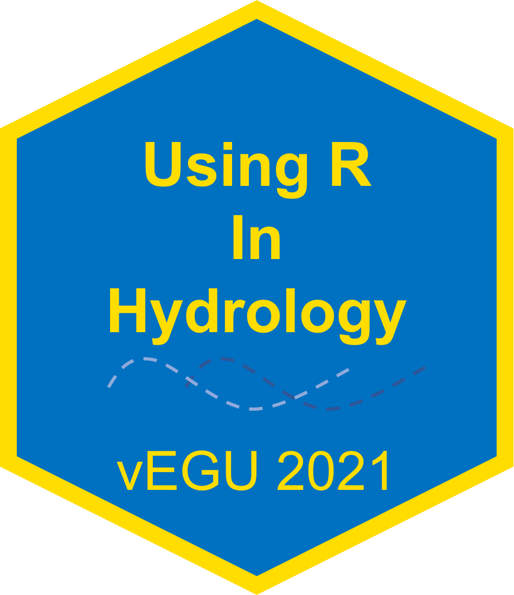
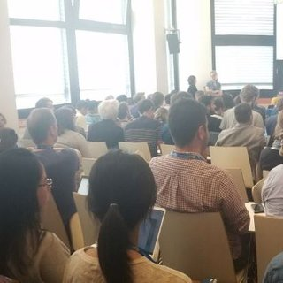
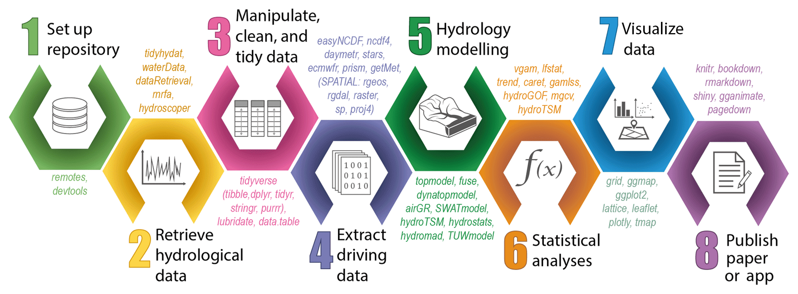

```{r setup, include=FALSE}
options(htmltools.dir.version = FALSE)

# color used in xaringanthemer
egu_blue <- rgb(red = 0, green = 112, blue = 192,maxColorValue = 255)
egu_yellow <- rgb(red = 255, green = 221, blue = 0,maxColorValue = 255)

# color used for font awesome icons
fa_color <- "lightgrey"

# SET XARINGTHEMER CHUNK TO EVAL = TRUE TO CHANGE THEME!
# xaringanthemer saves the resulting css theme in the main document directory.
# drop the 'statics/css/'  from the file path to use the new css file


# intsall missing packages
list.of.packages <- c("xaringan", "xaringanthemer", "emo", "fontawesome")
new.packages <- list.of.packages[!(list.of.packages %in% installed.packages()[,"Package"])]
if(length(new.packages)) install.packages(new.packages, repos = "http://cran.us.r-project.org")

```

```{r xaringan-themer, include = FALSE, eval = FALSE}
library(xaringanthemer)

# duo_accent(primary_color = rgb(red = 0, green = 112, blue = 192,maxColorValue = 255), 
# secondary_color = rgb(red = 255, green = 221, blue = 0,maxColorValue = 255))


duo_accent(primary_color =  darken_color(egu_blue, strength = 0.3),
           secondary_color = egu_yellow,
           inverse_background_color = egu_yellow,
           inverse_text_color =  egu_blue,
           title_slide_text_color = egu_yellow,
           link_color = "darkorange",
           black_color = "gray20",
           table_row_even_background_color = lighten_color(color_hex = egu_blue, 
                                                           strength = 0.8),
           
           extra_css = list(
               ".title-logo-box" = list(
                   "height" = "1750px",
                   "width" = "175px",
                   "position" = "absolute",
                   "top" = "55%",
                   "left" = "70%"
               )),
           outfile = "rhydro.css" 
           
)


```

class: title-slide, left, middle

<h1> Using R in Hydrology <br> 
EGU Short Course 2021</h1>

<br>


<h3> 
Katie Smith, <em>UKCEH</em> <br>
Louise Slater, <em>University of Oxford</em> <br> 
Ilaria Prosdocimi, <em> University of Venice </em> <br>
Guillaume Thirel, <em> INRAE </em> <br>
Abdou Khouakhi, <em> Cranfield University </em>
</h3>
<br>
<br>

.title-logo-box[]

---

# Agenda

 - Intro
 
 - Data Retrieval – Louise Slater 10:05-10:15
 
 - Extremes Modelling – Ilaria Prosdocimi 10:15-10:25
 
 - Hydrological Modelling – Guillaume Thirel 10:25-10:35
 
 - Hydrological Forecasting – Katie Smith 10:35-10:45
 
 - Google Earth Engine – Abdou Khouakhi 10:45-10:55
 
 - Q&A<sup>*</sup> – 10:55-11:00

.footnote[[*] Questions typed into the chat window will be answered by the convenors or the presenter once they have finished presenting.]

---

#Young Hydrologic Society

Today's short course has be co-organised by the YHS.<br>

Do consider joining the group!<br>

https://younghs.com/ <br>

 </br>

`r fontawesome::fa("twitter", fill = fa_color)` [twitter](https://twitter.com/YoungHydrology)  @YoungHydrology

---

# Accessing the materials

Materials from today's course will be available on `r fontawesome::fa("github", fill = fa_color)`Github.<br>

https://github.com/hydrosoc/rhydro_vEGU21

Past years' materials are on there as well.
.pull-left[
<small>Previous sessions have covered:
 - Good coding practice
 - Using R as GIS
 - Time-series visualisation
 - Extreme value stats
 - Hydrological modelling
 - Trend Analysis
 - Using APIs 
 - Processing, modelling and visualising hydrological data
 - Extracting netCDF climate data 
 - Parallel Programming and HPCs
 - Automating tasks
 - Shiny Apps </small>
 ]
 
.pull-right[
 ]
---

# Using R in Hydrology Paper

We have published a paper in HESS, take a look!

https://hess.copernicus.org/articles/23/2939/2019/


---

# Using R in Hydrology Paper

<br>
<br>
.center[]

---

# Task View

There is also a CRAN Task View for Hydrology, detailing all the R packages relevant to hydrology.

https://cran.r-project.org/web/views/Hydrology.html


---

# Hydrology in R facebook page

There is a facebook page "Hydrology in R" - do join us there for support. Please note the rules: Only post about R (not Python, ArcGIS etc), do not post about commercial training courses, and please post in English.


---

class: inverse, center, middle

# Data Retrieval

---

class: inverse, center, middle

# Extremes Modelling

---

class: inverse, center, middle

# Hydrological Modelling

---

class: inverse, center, middle

# Hydrological Forecasting

---


class: inverse, center, middle

# Google Earth Engine

---


class: inverse, center, middle

# Q&A

---

pagedown::chrome_print("N:/Travel/EGU/2021/intro_slides/rhydro_intro_slides.Rmd", browser="C:/Program Files/Google/Chrome/Application/chrome.exe")

