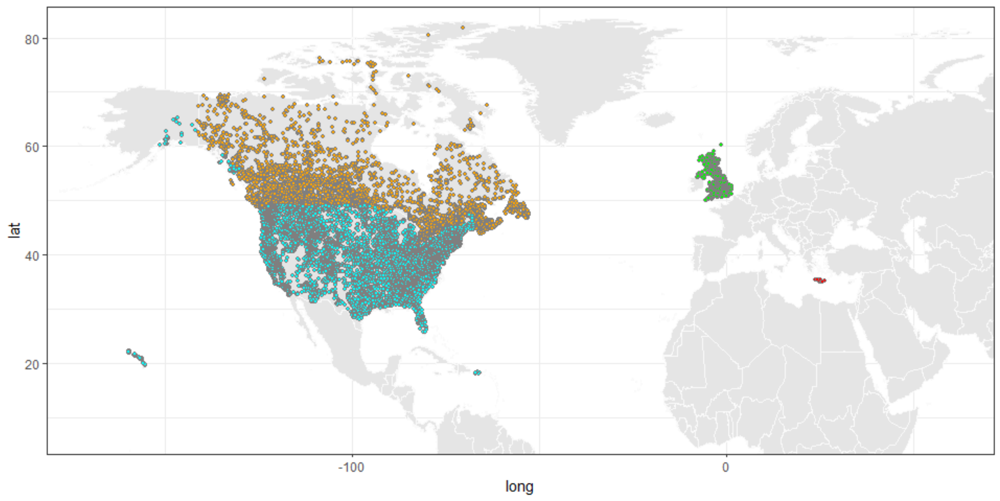
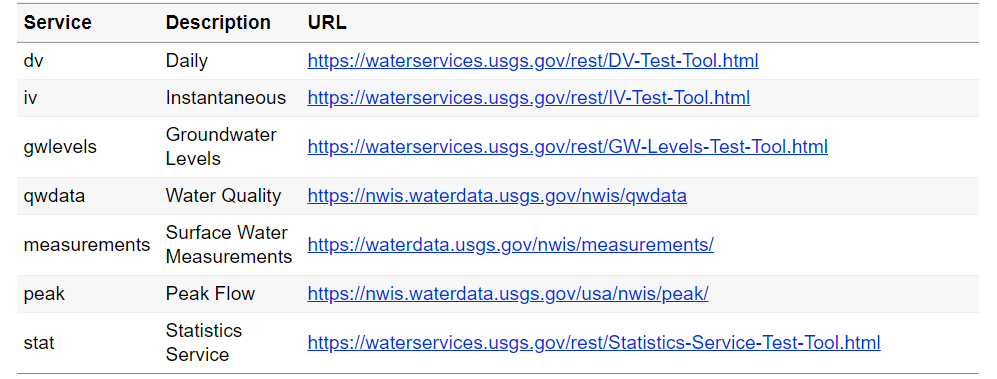
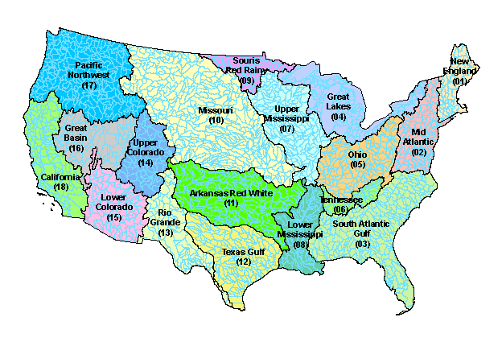
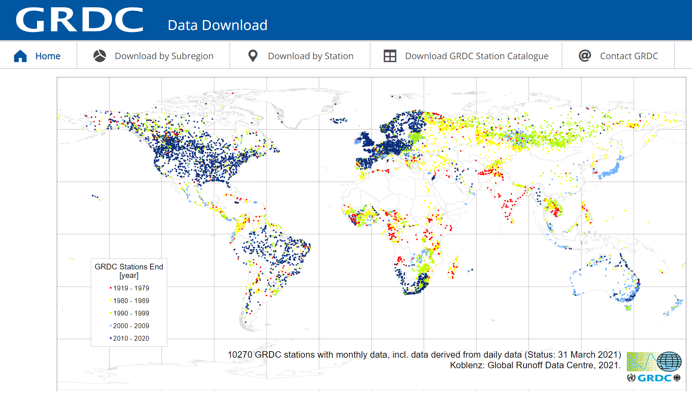
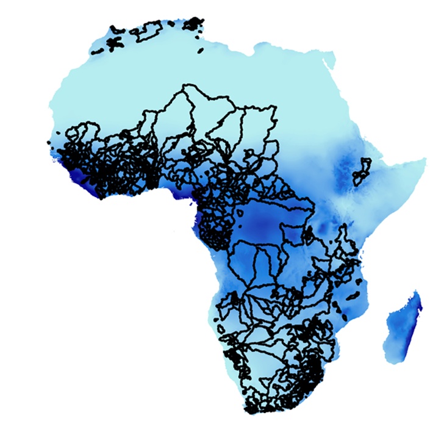
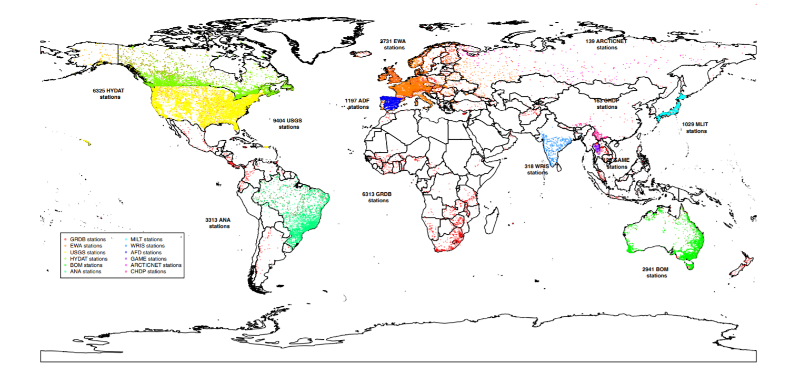

```{r setup, include=FALSE}
options(htmltools.dir.version = FALSE)

# color used in xaringanthemer
egu_blue <- rgb(red = 0, green = 112, blue = 192,maxColorValue = 255)
egu_yellow <- rgb(red = 255, green = 221, blue = 0,maxColorValue = 255)

# color used for font awesome icons
fa_color <- "lightgrey"

# SET XARINGTHEMER CHUNK TO EVAL = TRUE TO CHANGE THEME!
# xaringanthemer saves the resulting css theme in the main document directory.
# drop the 'statics/css/'  from the file path to use the new css file


# intsall missing packages
list.of.packages <- c("xaringan", "xaringanthemer", "emo", "fontawesome")
new.packages <- list.of.packages[!(list.of.packages %in% installed.packages()[,"Package"])]
if(length(new.packages)) install.packages(new.packages, repos = "http://cran.us.r-project.org")

```

```{r xaringan-themer, include = FALSE, eval = FALSE}
library(xaringanthemer)

# duo_accent(primary_color = rgb(red = 0, green = 112, blue = 192,maxColorValue = 255), 
# secondary_color = rgb(red = 255, green = 221, blue = 0,maxColorValue = 255))

duo_accent(primary_color =  darken_color(egu_blue, strength = 0.3),
           secondary_color = egu_yellow,
           inverse_background_color = egu_yellow,
           inverse_text_color =  egu_blue,
           title_slide_text_color = egu_yellow,
           link_color = "darkorange",
           black_color = "gray20",
           table_row_even_background_color = lighten_color(color_hex = egu_blue, 
                                                           strength = 0.8),
           
           extra_css = list(
               ".title-logo-box" = list(
                   "height" = "1750px",
                   "width" = "175px",
                   "position" = "absolute",
                   "top" = "55%",
                   "left" = "70%"
               )),
           outfile = "rhydro.css" 
)

```

class: title-slide, left, middle

<h1>Hydrological data retrieval in R</h1>

<br>

<h3>Louise Slater<br> <em>University of Oxford</em> </h3>
<br>
.small[`r fontawesome::fa("home", fill = fa_color)` [louisejslater.com](https://louisejslater.com)  
`r fontawesome::fa("twitter", fill = fa_color)` [DrLouiseSlater](https://twitter.com/DrLouiseSlater)]

.title-logo-box[]


---
## Overview of hydrometric data sources

Streamflow data can be download for several countries using R packages:
* UK -> [rnrfa package](https://cran.r-project.org/web/packages/rnrfa/rnrfa.pdf) by Vitolo et al. (2021)
* USA -> [dataRetrieval package](https://cran.r-project.org/web/packages/dataRetrieval/dataRetrieval.pdf) by DeCicco et al. (2021)
* Canada -> [tidyhydat package](https://cran.r-project.org/web/packages/tidyhydat/tidyhydat.pdf) by Albers et al. (2020)
* Greece -> [hydroscoper package](https://cran.r-project.org/web/packages/hydroscoper/hydroscoper.pdf) by Vantas et al. (2021)

```{r allsites1, echo=F, fig.align='center',  out.width=c("60%")}

```

Other data sources we will discuss include the CAMELS datasets (for [USA](https://hess.copernicus.org/articles/21/5293/2017/), [GB](https://doi.org/10.5194/essd-12-2459-2020),  [Australia](https://doi.org/10.5194/essd-2020-228),  [Brazil](https://doi.org/10.5194/essd-12-2075-2020),  [Chile](https://doi.org/10.5194/hess-22-5817-2018)); the African Database of Hydrometric Indices ([ADHI](https://doi.org/10.23708/LXGXQ9)); the Global Runoff Data Centre ([GRDC](https://www.bafg.de/GRDC/EN/Home/homepage_node.html)); the Global Streamflow Indices and Metadata Archive ([GSIM](https://essd.copernicus.org/articles/10/765/2018/)); and the European floods database ([Hall et al. 2015](https://piahs.copernicus.org/articles/370/89/2015/)).  


---
class: inverse, center, middle

# Before starting

---
## Install and load R packages 

Install packages:
```{r , eval=F,  message=F}
install.packages(tidyverse) # for data science functions
install.packages(ggplot2) # for nice plotting
install.packages(dataRetrieval) # USA 
install.packages(rnrfa) # UK 
install.packages(tidyhydat) # Canada
install.packages(hydroscoper) # Greece
```

Load them:
```{r , eval=T, fig.width=12, fig.height=4, message=F}
library(tidyverse) 
library(ggplot2) 
library(dataRetrieval) 
library(rnrfa)
library(tidyhydat) 
library(hydroscoper) 
```


---
## Global borders 

To plot the sites, we will need a shapefile of global borders:
```{r world, eval=T, show=T, fig.width=8, fig.height=4, message=F, warn=F}
world <- map_data("world") %>% 
  filter(region != "Antarctica") 

ggplot()+  
  geom_polygon(data = world, aes(long, lat, group = group), size=0.5,
               fill = "grey90", color = "gray20")+
  theme_bw()
``` 


---
class: inverse, center, middle

# United States

---
## United States: dataRetrieval package

We will use the dataRetrieval package by [DeCicco et al. (2021)](https://cran.r-project.org/web/packages/dataRetrieval/dataRetrieval.pdf). Useful tutorials include Laura DeCicco's [slides](https://owi.usgs.gov/R/dataRetrieval.html#1) and  [blogpost](https://waterdata.usgs.gov/blog/dataretrieval/).


What data are available?

```{r allsites, cache=T, echo=F, out.width=c("100%"), fig.align='center'}

```


---
## United States

Let's assume we want to download streamflow data for the **entire USA**: we first need to identify the **sites** (stream gauges).

Every multiple site query requires a major **filter** (a list of sites, stateCd, huc, bBox, or countyCd). We choose **hydrologic units**:
```{r, echo=F, out.width=c("70%"), fig.align='center'}

```


---
## United States

We download data for each HUC (01-21), and repeat this for all HUCs to retrieve the whole USA, e.g.:
```{r siteList, eval=F, message=F}
library(dataRetrieval)
USsites01 <- whatNWISdata(huc="01",parameterCd="00060")
USsites02 <- whatNWISdata(huc="02",parameterCd="00060")
USsites03 <- whatNWISdata(huc="03",parameterCd="00060")
USsites04 <- whatNWISdata(huc="04",parameterCd="00060")
USsites05 <- whatNWISdata(huc="05",parameterCd="00060")
USsites06 <- whatNWISdata(huc="06",parameterCd="00060")
USsites07 <- whatNWISdata(huc="07",parameterCd="00060")
USsites08 <- whatNWISdata(huc="08",parameterCd="00060")
... etc.
```

```{r siteListxx3, echo=F, eval=T, cache=T}
USsites01 <- whatNWISdata(huc="01",parameterCd="00060")
USsites02 <- whatNWISdata(huc="02",parameterCd="00060")
USsites03 <- whatNWISdata(huc="03",parameterCd="00060")
USsites04 <- whatNWISdata(huc="04",parameterCd="00060")
USsites05 <- whatNWISdata(huc="05",parameterCd="00060")
USsites06 <- whatNWISdata(huc="06",parameterCd="00060")
USsites07 <- whatNWISdata(huc="07",parameterCd="00060")
USsites08 <- whatNWISdata(huc="08",parameterCd="00060")
USsites09 <- whatNWISdata(huc="09",parameterCd="00060")
USsites10 <- whatNWISdata(huc="10",parameterCd="00060")
USsites11 <- whatNWISdata(huc="11",parameterCd="00060")
USsites12 <- whatNWISdata(huc="12",parameterCd="00060")
USsites13 <- whatNWISdata(huc="13",parameterCd="00060")
USsites14 <- whatNWISdata(huc="14",parameterCd="00060")
USsites15 <- whatNWISdata(huc="15",parameterCd="00060")
USsites16 <- whatNWISdata(huc="16",parameterCd="00060")
USsites17 <- whatNWISdata(huc="17",parameterCd="00060")
USsites18 <- whatNWISdata(huc="18",parameterCd="00060")
USsites19 <- whatNWISdata(huc="19",parameterCd="00060")
USsites20 <- whatNWISdata(huc="20",parameterCd="00060")
USsites21 <- whatNWISdata(huc="21",parameterCd="00060")
hucs <- paste0("USsites",sprintf('%0.2d', 1:21))
USsites <-  `row.names<-`(do.call(rbind,mget(hucs)), NULL)
```


---
## United States

Let's make a large database for all the HUCs with all the site-information:
```{r siteList41, echo=T, eval=F, message=F}
# A long but easy way of binding all HUCs 
# (because you need to type out 21 objects):
# USsites <- rbind(USsites01, USsites02....)

# Quicker approach:
hucs <- paste0("USsites",sprintf('%0.2d', 1:21))
USsites <-  `row.names<-`(do.call(rbind,mget(hucs)), NULL)
```

---
## United States

Check the dataset -- it has 56,991 sites!
```{r siteList42, echo=T, eval=T, cache=T, fig.width=10, fig.height=3, message=F}
head(USsites)[1:3]
```

Let's reduce the dataset to 9,057 sites:
```{r siteList43, echo=T, eval=T, cache=T, fig.width=10, fig.height=3, message=F}
USsites <- USsites[USsites$begin_date < as.Date("1950-01-01"),]
```

---
## United States: site location

```{r USmap, eval=T, show=T, fig.width=7, fig.height=4, message=F, warn=F}
ggplot()+  
  geom_polygon(data = world, aes(long, lat, group = group), size=0.5,
               fill = "gray90", color = "gray98") +
  coord_cartesian(xlim=c(-170,-60), ylim=c(18,65))+
  geom_point(data = USsites, aes(x=dec_long_va,y=dec_lat_va), 
             fill="pink", col="grey30", size=2, pch=21)+ 
  theme_bw()
```

---
## United States: time series

How do we retrieve the actual time series?
Let's select just one record from our database: USGS site **05420500**: 

```{r USQ, eval=T, fig.width=10, fig.height=3, cache=T, message=F}
dfUS <- dataRetrieval::readNWISdv("05420500","00060","","")
#Rename the streamflow variable:
names(dfUS)[names(dfUS) == 'X_00060_00003'] <- 'Q'
head(dfUS)
```

---
## United States: time series

It's always worth plotting data to check for errors
```{r USQplot, eval=T, show=T, fig.width=10, fig.height=4, message=F, warn=F}
ggplot(dfUS)+
  geom_line(aes(x=Date, y=Q), col="blue")+
  theme_bw()

```


---
class: inverse, center, middle

# United Kingdom

---
## United Kingdom: rnrfa package

We will use the **rnrfa** package by [Vitolo et al. (2021)](https://cran.r-project.org/web/packages/rnrfa/rnrfa.pdf). Check out Claudia Vitolo's [vignette](https://cran.r-project.org/web/packages/rnrfa/vignettes/rnrfa-vignette.html).

Obtain list of sites:
```{r , eval=T, show=T, fig.width=10, fig.height=3, message=F, warn=F}
library(rnrfa)
UKsites <- rnrfa::catalogue()
UKsites <- data.frame(UKsites)
# unique(UKsites$id) # list of sites
head(UKsites)[1:3] 

```

---
## United Kingdom: site location

```{r , eval=T, show=T, fig.width=5, fig.height=4.5, message=F, warn=F}
ggplot()+ theme_bw()+ 
  geom_polygon(data = world, aes(long, lat, group = group),  
               size=0.5, fill = "grey90", color = "gray98") + 
  coord_cartesian(xlim=c(-10,3), ylim=c(50,60))+
  geom_point(data = UKsites, aes(x=longitude,y=latitude), 
             pch=21, color="blue2", fill="lightblue")
```

---
## United Kingdom: time series

Download just one site: e.g. the [River Thames at Kingston](https://nrfa.ceh.ac.uk/data/station/info/39001), site 39001

```{r , eval=T, show=T, message=F, warn=F}
df <- as.data.frame(gdf(id=39001, metadata = TRUE))
df$Date <- as.Date(row.names(df))
names(df)[names(df) == 'gdf'] <- 'Q'
```

Time series:
```{r , eval=T, show=T, fig.width=10, fig.height=3, message=F, warn=F}
ggplot(df)+
  geom_line(aes(x=Date, y=Q), col="blue")+
  theme_bw()
```

---
class: inverse, center, middle

# Canada

---
## Canada: hydat package


Below we use the tidyhydat package by [Albers et al. (2020)](https://cran.r-project.org/web/packages/tidyhydat/tidyhydat.pdf). Check out Sam Albers's vignettes: [intro](https://cran.r-project.org/web/packages/tidyhydat/vignettes/tidyhydat_an_introduction.html) and [examples](https://cran.r-project.org/web/packages/tidyhydat/vignettes/tidyhydat_example_analysis.html).

First, as before, retrieve list of sites:
```{r hydat, eval=T, show=T, fig.width=7, fig.height=5, message=F, warn=F}
library(tidyhydat)

# download_hydat() # this takes about 10 minutes
CAsites <- hy_stations()

# retrieve list of sites
sites <- unique(CAsites$STATION_NUMBER)
sites[1:3] # first three
```


---
## Canada: site location

```{r plothydat, eval=T, show=T, fig.width=8, fig.height=5, message=F, warn=F}
ggplot()+  
  geom_polygon(data = world, aes(long, lat, group = group),  size=0.5,
               fill = "grey90", color = "gray98") + 
  coord_cartesian(xlim=c(-150,-50), ylim=c(40,83))+
  geom_point(data = CAsites, aes(x=LONGITUDE,y=LATITUDE))+
  theme_bw()
```      

---
## Canada: time series

To download one site:
```{r , eval=T, show=T, message=F, warn=F}
dfC <- hy_daily_flows(station_number = "08LA001")
names(dfC)[names(dfC) == "Value"] <- "Q"
```

Time series:
```{r , eval=T, show=T, fig.width=10, fig.height=3, message=F, warn=F}
ggplot(dfC)+
  geom_line(aes(x=Date, y=Q), col="blue")+
  theme_bw()
```

---
class: inverse, center, middle

# Greece

---
## Greece: hydroscoper package

We will use the hydroscoper package by [Vantas et al. (2021)](https://cran.r-project.org/web/packages/hydroscoper/hydroscoper.pdf). See Konstantinos Vantas's [blogpost](https://ropensci.org/blog/2018/04/03/hydroscoper/) and [vignette: an introduction to hydroscoper](https://cran.r-project.org/web/packages/hydroscoper/vignettes/intro_hydroscoper.html).


Retrieve list of sites:

```{r greece, eval=T, show=T, fig.width=7, fig.height=5, message=F, warn=F}
library(hydroscoper)

# load full data catalogue
data("stations")
GRcatalogue <- subset(stations, 
                  subdomain =  c("kyy", "ypaat", "emy", "deh"),)
```

---
## Greece: variables
  
Multiple variables are available:
```{r greece_ts, eval=T, show=T, fig.width=7, fig.height=5, message=F, warn=F}
data("timeseries")
unique(timeseries$variable)[1:10]
```

We only want streamflow:
```{r greece_ts2, eval=T, show=T, fig.width=7, fig.height=5, message=F, warn=F}
timeseries <- subset(timeseries, variable=="flow")
# Merge in the lat/lon
GRsites <- merge(timeseries, GRcatalogue, all.x=TRUE)
```

---
## Greece: site location

```{r plotgr, eval=T, show=T, fig.width=7, fig.height=4, message=F, warn=F}
ggplot()+  
  geom_polygon(data = world, aes(long, lat, group = group),  
               size=0.5, fill = "grey90", color = "gray98") + 
  coord_cartesian(xlim=c(20,30), ylim=c(30,40))+
  geom_point(data = GRsites, aes(x=longitude,y=latitude))+
  theme_bw()
```      

---
## Greece: time series

Select one site using the time_id from the dataset (GRsites)
```{r , eval=T, show=T, message=F, warn=F}
dfG <- get_data(subdomain = "kyy", time_id = 753)
names(dfG)[names(dfG) == "value"] <- "Q"
```

Time series:
```{r , eval=T, show=T, fig.width=10, fig.height=3, message=F, warn=F}
ggplot(dfG)+
  geom_line(aes(x=date, y=Q), col="blue")+
  theme_bw()
```


---
class: inverse, center, middle

# All 4 countries

---
## All countries

Let's add together the different datasets we obtained

```{r worldmap1, eval=F, show=T, cache=T, fig.width=7, fig.height=5, message=F, warn=F}
ggplot()+  
  geom_polygon(data = world, aes(long, lat, group = group),  size=0.5,
               fill = "grey90", color = "gray98") + 
  geom_point(data = GRsites, aes(x=longitude, y=latitude),
             pch=21, size=1,col="grey50",fill="red")+
  geom_point(data = CAsites, aes(x=LONGITUDE, y=LATITUDE),
             pch=21, size=1,col="grey50",fill="orange")+
  geom_point(data = UKsites, aes(x=longitude, y=latitude),
             pch=21, size=1,col="grey50",fill="green")+
  geom_point(data = USsites, aes(x=dec_long_va, y=dec_lat_va),
             pch=21, size=1,col="grey50",fill="cyan")+
  coord_cartesian(xlim=c(-170,60), ylim=c(7,82))+
  theme_bw()

```   

---
## All countries

Let's add together the different datasets we obtained

```{r worldmapx, eval=T, echo=F, fig.width=10, fig.height=5, message=F, warn=F}
ggplot()+  
  geom_polygon(data = world, aes(long, lat, group = group),  size=0.5,
               fill = "grey90", color = "gray98") + 
  geom_point(data = GRsites, aes(x=longitude, y=latitude),
             pch=21, size=1,col="grey50",fill="red")+
  geom_point(data = CAsites, aes(x=LONGITUDE, y=LATITUDE),
             pch=21, size=1,col="grey50",fill="orange")+
  geom_point(data = UKsites, aes(x=longitude, y=latitude),
             pch=21, size=1,col="grey50",fill="green")+
  geom_point(data = USsites, aes(x=dec_long_va, y=dec_lat_va),
             pch=21, size=1,col="grey50",fill="cyan")+
  coord_cartesian(xlim=c(-170,60), ylim=c(7,82))+
  theme_bw()
```   

---
class: inverse, center, middle

# Additional datasets worth exploring!

---
## Global Runoff Data Centre (GRDC)

Global data can be obtained from the Global Runoff Data Centre ([GRDC](https://www.bafg.de/GRDC/EN/Home/homepage_node.html)) -- see the portal [here](https://portal.grdc.bafg.de/applications/public.html?publicuser=PublicUser#dataDownload/Home). 

```{r grdc, cache=T, echo=F, out.width=c("60%"), fig.align='center'}

```

For instance, in this paper we combined multiple real-time datasets with the GRDC dataset: Slater et al (2021). [Global Changes in 20‐year, 50‐year and 100‐year River Floods](https://agupubs.onlinelibrary.wiley.com/doi/full/10.1029/2020GL091824). _Geophysical Research Letters_, e2020GL091824


---
## CAMELS datasets

The CAMELS (catchment attributes and meteorology for large-sample studies) datasets provide large integrated hydrologic datasets for regions of the world. CAMELS datasets already exist for:
* USA ([Addor et al. 2017](https://hess.copernicus.org/articles/21/5293/2017/))
* GB ([Coxon et al. 2020](https://doi.org/10.5194/essd-12-2459-2020))
* Australia ([Fowler et al. 2021](https://doi.org/10.5194/essd-2020-228))
* Brazil ([Chagas et al. 2020](https://doi.org/10.5194/essd-12-2075-2020))
* Chile ([Alvarez et al. 2018](https://doi.org/10.5194/hess-22-5817-2018)). 

They usually include both the daily **time series** and catchment **attributes** (including topography, climate, hydrology, land cover, soils, and hydrogeology), and so are an extremely valuable resource. 

---
## Africa: the ADHI

The African Database of Hydrometric Indices (ADHI) by [Tramblay & Rouché 2020](https://doi.org/10.23708/LXGXQ9) contains catchment boundaries + time series for multiple stations of:
* annual minimum of 7-day discharge
* annual maximum runoff
* mean annual runoff
* streamflow percentiles (...& more)

```{r ADHI, cache=T, echo=F, out.width=c("40%"), fig.align='center'}

```


---
## GSIM

The Global Streamflow Indices and Metadata Archive ([GSIM](https://essd.copernicus.org/articles/10/765/2018/)) contains **indices and metadata**. It includes:
* A metadata catalogue; 
* Catchment boundaries;
* Catchment metadata, from 12 gridded global data products (e.g. land cover type, soil type, and climate and topographic characteristics). 

```{r GSIM, cache=T, echo=F, out.width=c("75%"), fig.align='center'}

```


---
## European Floods Database

The European Flood Database was described in [Hall et al. 2015](https://piahs.copernicus.org/articles/370/89/2015/). Annual time series for multiple sites (1960-2010) were shared as follows:

* The **dates** of annual maximum streamflows or water levels (daily or instantaneous values) for each calendar year, for 4,062 catchments (used in [Blöschl et al. 2017](https://science.sciencemag.org/content/357/6351/588)), available [here](www.hydro.tuwien.ac.at/fileadmin/mediapool-hydro/Downloads/Data.zip). 

* The **annual maximum specific discharge** (m^3/s)/km^2 for each year (used in [Blöschl et al. 2019](https://www.nature.com/articles/s41586-019-1495-6)), available [here](https://github.com/tuwhydro/europe_floods).

---
## Conclusions

I hope you have found this useful. It is straightforward to parallelise the download for many sites at once (see the presentation from the [2019 short course](https://github.com/hydrosoc/rhydro_EGU19))!

Keep an eye on [CRAN](https://cran.r-project.org/web/packages/available_packages_by_name.html) and  the [Hydrology task force](https://cran.r-project.org/web/views/Hydrology.html) for any new packages.

And please email me if you discover any other datasets or packages, so we can update this community resource in future years! (`louise.slater@ouce.ox.ac.uk`)

