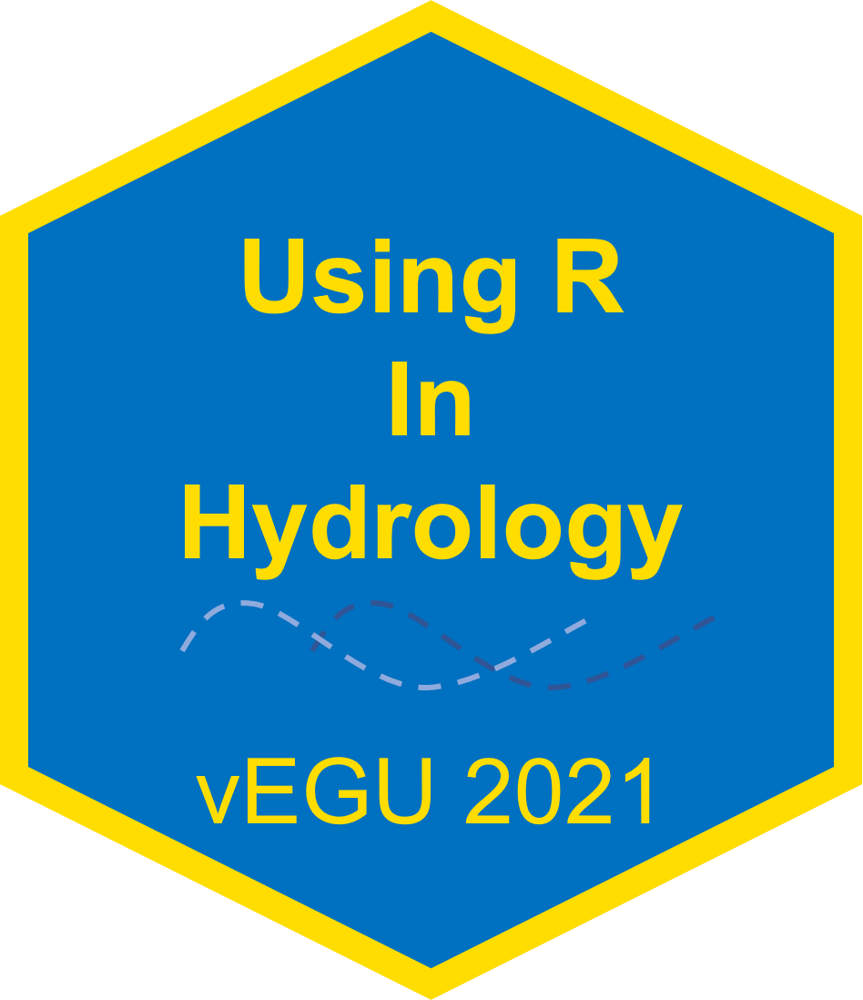

# Using R in Hydrology EGU theme 


This theme is adapted from the previous [using R in hydrology EGU2019](https://github.com/hydrosoc/rhydro_rmd_theme). The Theme is  based on [xaringan](https://github.com/yihui/xaringan) and was modified using [xaringanthemer](https://pkg.garrickadenbuie.com/xaringanthemer/index.html). 

## How to

If you want to change the theme using `xaringanthemer`, set the second code chunks' option `eval = TRUE`. Make sure to install the `xaringanthemer` package beforehand:

```
devtools::install_github("gadenbuie/xaringanthemer")
```

You can start working directly in the provided `.Rmd` - it contains the sample presentation provided by `xaringan` (knit the presentation, or use the "infinite moon reader" add-in that comes with the package to preview the slides.

**Note**, that you can alternatively just grab the `.css` files from the [static/css](static/css) folder and specify theme in the yaml header of your presentation. In that case, make sure to also grab the logo and include it on your title slide via the custom `css` tag:

```
.title-logo-box[]
```

This places the logo in a box at the bottom right screen at 175px by 175px.
