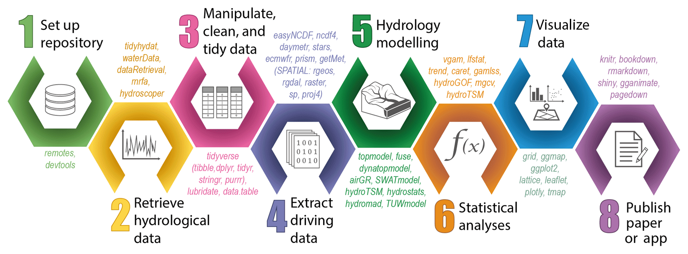
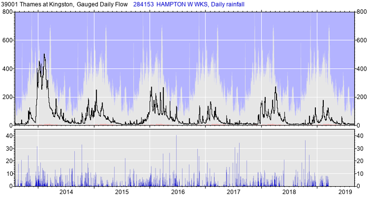
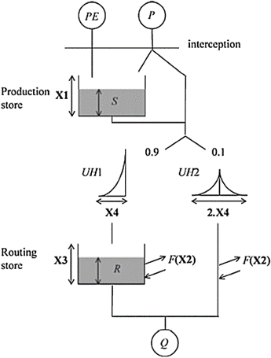
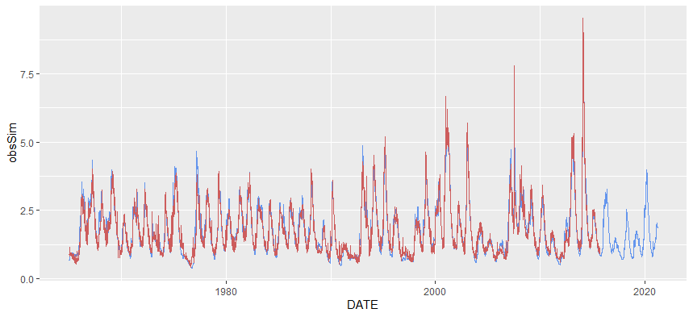
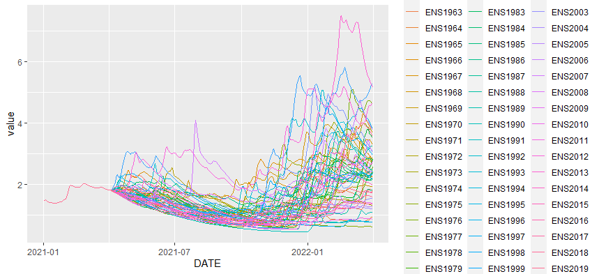
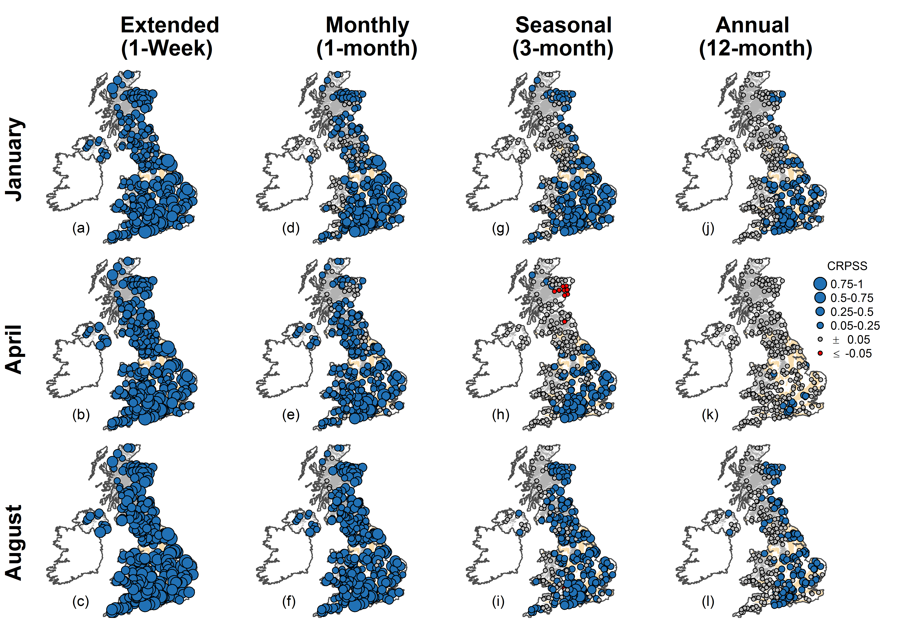
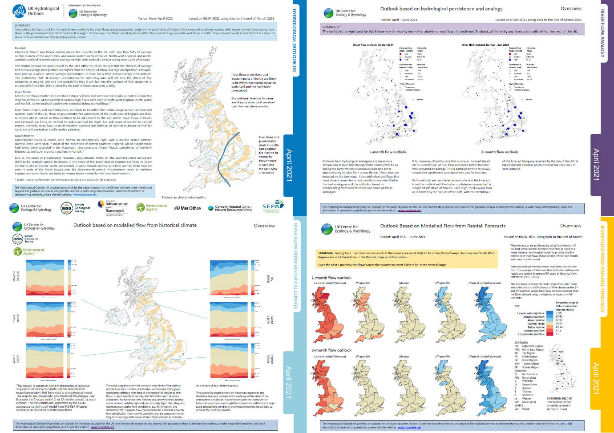

```{r setup, include=FALSE}
options(htmltools.dir.version = FALSE)

# color used in xaringanthemer
egu_blue <- rgb(red = 0, green = 112, blue = 192,maxColorValue = 255)
egu_yellow <- rgb(red = 255, green = 221, blue = 0,maxColorValue = 255)

# color used for font awesome icons
fa_color <- "lightgrey"

# SET XARINGTHEMER CHUNK TO EVAL = TRUE TO CHANGE THEME!
# xaringanthemer saves the resulting css theme in the main document directory.
# drop the 'statics/css/'  from the file path to use the new css file


# intsall missing packages
list.of.packages <- c("xaringan", "xaringanthemer", "emo", "fontawesome")
new.packages <- list.of.packages[!(list.of.packages %in% installed.packages()[,"Package"])]
if(length(new.packages)) install.packages(new.packages, repos = "http://cran.us.r-project.org")

```

```{r xaringan-themer, include = FALSE, eval = FALSE}
library(xaringanthemer)

# duo_accent(primary_color = rgb(red = 0, green = 112, blue = 192,maxColorValue = 255), 
# secondary_color = rgb(red = 255, green = 221, blue = 0,maxColorValue = 255))


duo_accent(primary_color =  darken_color(egu_blue, strength = 0.3),
           secondary_color = egu_yellow,
           inverse_background_color = egu_yellow,
           inverse_text_color =  egu_blue,
           title_slide_text_color = egu_yellow,
           link_color = "darkorange",
           black_color = "gray20",
           table_row_even_background_color = lighten_color(color_hex = egu_blue, 
                                                           strength = 0.8),
           
           extra_css = list(
               ".title-logo-box" = list(
                   "height" = "1750px",
                   "width" = "175px",
                   "position" = "absolute",
                   "top" = "55%",
                   "left" = "70%"
               )),
           outfile = "rhydro.css" 
           
)


```


class: title-slide, left, middle

<h1>Hydrological Forecasting in R</h1>

<br>

<h3>Katie Smith<br> <em>UK Centre for Ecology & Hydrology</em> </h3>
<br>
.small[`r fontawesome::fa("home", fill = fa_color)` [https://www.ceh.ac.uk/staff/katie-smith](https://www.ceh.ac.uk/staff/katie-smith)  
`r fontawesome::fa("twitter", fill = fa_color)` [katieasmith26](https://twitter.com/katieasmith26)]

.title-logo-box[]

---

# Forecasting in R
As with any piece of R work, forecasting has a pretty standard workflow of:
 - setting up version control 
 - retrieving hydrological data for calibration
 - tidying data
 - extracting driving climate data
 - applying a hydrological model
 - analysing, visualising, and publishing the results

.center[]

---

# Climatology
The most basic forecast that we could make is "climatology". This is simply looking at the observed streamflow at this time of year for each year in the past, and using those to form a distribution.
<br>
<br>
<br>
.center[]

---

# Ensemble Streamflow Prediction
A step up from that is ESP, a very simple method of forecasting that does not require a hydrological forecast. 
We know our initial conditions, so some of the years in the climatology may not be appropriate.

.center[]

---

# Ensemble Streamflow Prediction
.pull-left[We can model the flow up until the present day, using observed climate data.
<br>


.center[]]


.pull-right[
.center[]]


---

# Ensemble Streamflow Prediction
Then ESP simply uses past years of observed climate data, and runs a hydrological model as if that climate were to happen from today.
<br>
<br>
.center[]


---
# Ensemble Streamflow Prediction
.center[]

---
class: inverse, center, middle

# So let's have a go!
Ensemble Streamflow Prediction with GR4J

---

The first step is to calibrate the GR4J model. A workthrough on how to do that can be found in the R notebook at:

https://github.com/hydrosoc/rhydro_vEGU21/tree/main/presentations/04.hydro_forecasting_KAS/2017_hydro_modelling_files

.center[]

---

# You'll need some packages:

```{r eval=FALSE}
library(airGR)
library(dplyr)
library(ggplot2)
library(reshape2)
```

.pull-left[
I also used a couple of personal functions to make life easier that:
 - remove leap years from a date series
 - make formatted dates from simple arguments (dd,mm,yyyy)]

.title-logo-box[]

---

# Setting Up

We're working on the Lambourn catchment in the UK, a very groundwater dominated catchment. This is where ESP works the best, as it gets a lot of skill from flow persistence.
```{r eval=FALSE}
# set station and its area
BasinInfoAll<-c(39019,234.1)
getwd()
# Read BasinObs
BasinObs <- read.csv("./Final_New_BasinObs_1961_2017_39019.csv")
BasinObs$DATE <- as.POSIXct(BasinObs$DATE, format = dateFormat)
# Model parameters
Param <- c(455.6977636,-11.6614573,1085.473369,10.2877058)
# set data
DatesR    <- as.POSIXlt(BasinObs$DATE)
Precip    <- BasinObs$PRECIP 
PotEvap   <- BasinObs$PET
CatchArea <- BasinInfoAll[2]
```
<br>
<br>
--- 
---

# Running a baseline 
```{r eval=FALSE}
# RUN GR4J FOR OBS PERIOD
InputsModel <- CreateInputsModel(FUN_MOD = RunModel_GR4J, 
                                 DatesR = DatesR, 
                                 Precip = Precip, 
                                 PotEvap = PotEvap)
Ind_Run <- seq(1:length(DatesR))
RunOptions <- suppressWarnings(CreateRunOptions(FUN_MOD = RunModel_GR4J,
                                                InputsModel = InputsModel, 
                                                IndPeriod_Run = Ind_Run,
                                                IniStates = NULL, 
                                                IniResLevels = NULL, 
                                                IndPeriod_WarmUp = NULL))
OutputsModel <- RunModel_GR4J(InputsModel = InputsModel,
                             RunOptions  = RunOptions,
                             Param       = Param)

```

---

# Post process the output
```{r eval=FALSE}
obsSim<-as.data.frame(matrix(ncol=2,nrow=length(BasinObs$DATE),NA))
obsSim[,1]<-BasinObs$DATE
obsSim[,2]<-OutputsModel$Qsim
# Remove first 4 years as warm-up as change DATE to as.Date
colnames(obsSim) <- c("DATE", "obsSim")
obsSim$DATE<-as.Date(obsSim$DATE)
obsSim <- obsSim[which(obsSim$DATE > MakeDate(31,12,1964)), ]
# convert to cumecs
obsSim$obsSim <- (obsSim$obsSim * CatchArea) / 86.4
# merge with obs
obsSim$obs <- BasinObs$FLOW_cumecs[which(BasinObs$DATE==as.POSIXct(obsSim$DATE[1])):
                                     length(BasinObs$DATE)]
```

---

# Plotting the baseline run

```{r eval=FALSE}
# MAKE A PLOT
ggplot(obsSim)+
  geom_line(aes(x=DATE,y=obsSim),color="cornflower blue")+
  geom_line(aes(x=DATE,y=obs), color="indianred")
```
.center[]

---

# Get historic forecast data ready

```{r, eval=FALSE}
#remove the first few months to mirror start month of forecast
BasinObs <- read.csv("./Final_New_BasinObs_1961_2017_39019.csv")
BasinObs$DATE <- as.Date(BasinObs$DATE)
BasinObs<-BasinObs[which(BasinObs$DATE >= MakeDate(01,04,1961)),]

#remove leap years from BasinObs
NoLeap <- RemoveLeapDay(BasinObs$DATE)
BasinObsNoLeap <- as.data.frame(NoLeap)
colnames(BasinObsNoLeap)<-c("DATE")
BasinObsNoLeap <- left_join(BasinObsNoLeap, BasinObs, by = "DATE")
```
<br>
<br>
.center[]

---

# Get historic forecast data ready

Make input matrix for Precip
```{r eval=FALSE}
PrecipESPin<-as.data.frame(matrix(NA,nrow=length(BasinObsNoLeap$DATE),ncol=(2021-1961)+1))
colnames(PrecipESPin)<-c("DATE",paste0("ENS",seq(1961,2020)))
PrecipESPin$DATE<-RemoveLeapDay(seq(MakeDate(01,04,1961),MakeDate(31,03,2021),by="day"))
PrecipESPin[1:length(BasinObsNoLeap$DATE),2:ncol(PrecipESPin)]<-BasinObsNoLeap$PRECIP
precipmatrix<-as.data.frame(matrix(BasinObsNoLeap$PRECIP,nrow=365,byrow=F))
colnames(precipmatrix)<-paste0("ENS",seq(1961,2020))
precipmatrix$DATE<-RemoveLeapDay(seq(MakeDate(01,04,2021),MakeDate(31,03,2022),by="day"))
PrecipESPin<-rbind(PrecipESPin,precipmatrix)
head(PrecipESPin)
```
.center[]

---

# Get historic forecast data ready

Do the same for PET

```{r eval=FALSE}
PetESPin<-as.data.frame(matrix(NA,nrow=length(BasinObsNoLeap$DATE),ncol=(2021-1961)+1))
colnames(PetESPin)<-c("DATE",paste0("ENS",seq(1961,2020)))
PetESPin$DATE<-RemoveLeapDay(seq(MakeDate(01,04,1961),MakeDate(31,03,2021),by="day"))
PetESPin[1:length(BasinObsNoLeap$DATE),2:ncol(PetESPin)]<-BasinObsNoLeap$PET
petmatrix<-as.data.frame(matrix(BasinObsNoLeap$PET,nrow=365,byrow=F))
colnames(petmatrix)<-paste0("ENS",seq(1961,2020))
petmatrix$DATE<-RemoveLeapDay(seq(MakeDate(01,04,2021),MakeDate(31,03,2022),by="day"))
PetESPin<-rbind(PetESPin,petmatrix)
```
And make an output matrix
```{r eval=FALSE}
ESPforecasts<-as.data.frame(matrix(NA,nrow=length(BasinObsNoLeap$DATE)+365,ncol=(2021-1961)+1))
colnames(ESPforecasts)<-c("DATE",paste0("ENS",seq(1961,2020)))
ESPforecasts$DATE<-RemoveLeapDay(seq(MakeDate(01,04,1961),MakeDate(31,03,2022),by="day"))
```

---

# RUN ESP

```{r eval = FALSE}
for (i in 2:61){
  DatesR    <- as.POSIXlt(ESPforecasts$DATE)
  Precip    <- PrecipESPin[,i] 
  PotEvap   <- PetESPin[,i]
  CatchArea <- BasinInfoAll[2]
  InputsModel <- CreateInputsModel(FUN_MOD = RunModel_GR4J, DatesR = DatesR, 
                                   Precip = Precip, PotEvap = PotEvap)
  Ind_Run <- seq(1:length(DatesR))
  
  RunOptions <- suppressWarnings(CreateRunOptions(FUN_MOD = RunModel_GR4J,
                                                  InputsModel = InputsModel, 
                                                  IndPeriod_Run = Ind_Run,
                                                  IniStates = NULL, IniResLevels = NULL, 
                                                  IndPeriod_WarmUp = NULL))
    OutputsModel <- RunModel_GR4J(InputsModel = InputsModel,RunOptions = RunOptions, 
                                  Param = Param)
  ESPforecasts[,i]<-OutputsModel$Qsim
}
# convert runoff (mm/day) to flow (M3/s)
ESPforecasts_m3s <- ESPforecasts
ESPforecasts_m3s[,2:61] <- (ESPforecasts[2:61] * CatchArea) / 86.4
```

---

# Plot the forecast
```{r eval = FALSE}
# MAKE A PLOT
ESPsub<-ESPforecasts_m3s[which(ESPforecasts$DATE>MakeDate(01,01,2021)),]
ESPmelt <- melt(ESPsub,id.var="DATE")
ggplot(ESPmelt,aes(x=DATE,y=value))+
  geom_line(aes(colour=variable))
```
.center[]

---

# Assessing the Skill
<small>It is important to assess the skill of your forecasting system. You can do this by setting up a "hindcast" experiment (making forecasts of a past date), that you can then compare with observations.
For more on this, and how we assessed our system, using the easyVerification R package, see Harrigan et al (2018) https://hess.copernicus.org/articles/22/2023/2018/ </small>

<center></img></center>

---

class: inverse, center, middle

# How we use our forecasts

---
# UK Hydrological Outlook

<small>The ESP method, along with two other methods of hydrological forecasting (1 - persistence and analogues statistical forecasting, and 2 - forcasting using dynamic climate forecasts), are combined with groundwater forecasts to produce our UK Hydrological Outlook. www.hydoutuk.net </small>

<center></img></center>

---

# UK Outlook Portal
<small> We are developing a new interactive web portal, that will allow our users to look at the data in detail. Check back on this link in a couple of months when it will be open to the public. https://eip.ceh.ac.uk/Hydrology/outlooks/ </small>

<center></img></center>


---

# UK Outlook Portal
<small> This page allows users to look at how many of the ensemble members sit in each category, below normal, normal and above normal. https://eip.ceh.ac.uk/Hydrology/outlooks/ </small>

<center></img></center>

---

# UK Outlook Portal
<small> This page show users the full ensemble distributions for the forecasts moving forward, against the historic bands of normal flows. https://eip.ceh.ac.uk/Hydrology/outlooks/ </small>

<center></img></center>

---
# UK Outlook Portal
<small> Finally, this page allows users to select past years of interest to see how the forecast would run if that weather were to happen again now. It also lets users define flow thresholds, and the bottom plot shows the likelihood of flows falling below those thresholds. This is particularly useful for reservoir management. https://eip.ceh.ac.uk/Hydrology/outlooks/ </small>

<center></img></center>

---

class: inverse, center, middle

# Thank you for listening!

The slides and materials are available on Github:
https://github.com/hydrosoc/rhydro_vEGU21/

---

pagedown::chrome_print("N:/Travel/EGU/2021/04.hydro_forecasting_KAS/hydro_forecasting_slides.Rmd", browser="C:/Program Files/Google/Chrome/Application/chrome.exe")

