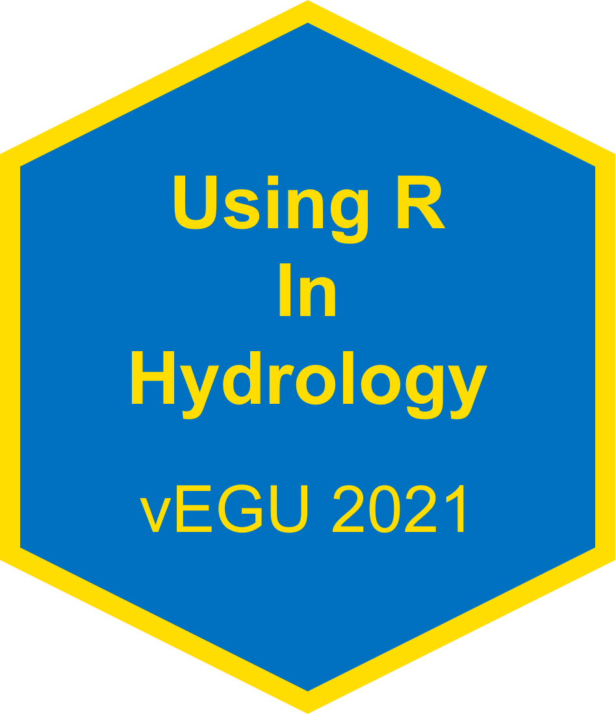
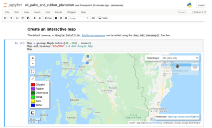
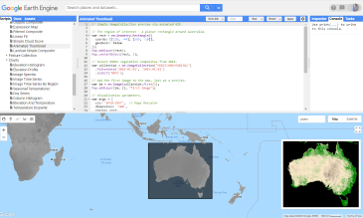

```{r setup, include=FALSE}
options(htmltools.dir.version = FALSE)
knitr::opts_chunk$set(fig.retina = 3, warning = FALSE, message = FALSE)


```


```{r presi-setup, include=FALSE}


# color used in xaringanthemer
egu_blue <- rgb(red = 0, green = 112, blue = 192,maxColorValue = 255)
egu_yellow <- rgb(red = 255, green = 221, blue = 0,maxColorValue = 255)

# color used for font awesome icons
fa_color <- "lightgrey"

```


class: title-slide, left, middle

<h1> Google Earth Engine <br> 
for hydrology in R

<br>


<h3> Abdou Khouakhi <br> 
<em> Cranfield University </em> 
</h3>
<br>
<br>
 
`r fontawesome::fa("twitter", fill = fa_color)` [@akhouakhi](https://twitter.com/ab_khouakhi)


.title-logo-box[]


************************************************************


---

# Outline

.middle[

- #### Introduction to Google Earth Engine (GEE) and `rgee` Package

- #### Quick demo 1: hydrological data retrieval using `rgee`

- #### Quick demo 2: Simple example of machine learning in GEE

**Notes:**
-  This presentation is also accompanied by an [R script]() to execute in Rstudio

- You need to sign up for a [Google Earth Engine account](https://signup.earthengine.google.com/#!/) to be able to access data and computing capabilities.

]
--

---

layout: false
class: inverse, center, middle

# Google Earth Engine
--

---

# Google Earth Engine - What is it? 

Google Earth Engine is a computing platform that allows users to run geospatial analysis on Google's infrastructure.

The main components of GEE:

- [Datasets](https://developers.google.com/earth-engine/datasets/): A petabyte-scale archive of publicly available remotely sensed imagery and other data.

- [Compute power](https://reader.elsevier.com/reader/sd/pii/S0034425717302900?token=2AC58EA43ED5306A13DA0E6AF50A5F286D59B455B45F52F9932FE71845E5C75C706C78E079BC3769B23B256612A225D0): Google’s computational infrastructure optimized for parallel processing of geospatial data.
- [APIs](https://developers.google.com/earth-engine/guides): APIs for JavaScript and Python (hosted on GitHub) for making requests to the Earth Engine servers.

- [Code Editor](https://code.earthengine.google.com/): An online Integrated Development Environment (IDE) for rapid prototyping and visualization of complex spatial analyses using the Javascript API.

- [Apps](https://www.earthengine.app/): A dynamic, publicly accessible user interface for Earth Engine analyses.
--


---
## Data structure in GEE 

- Data in GEE are structured in Collections; a stack or time series of images or gridded datasets and features

- For example, all of the images produced by a single sensor are grouped together and presented as a “collection”. 

- Collections can be filtered, sorted, joined, mapped, or reduced

- An Image can be a Stack of Georeferenced bands

- Each band has its own Mask, Projection, Resolution and a list of properties (Date, bbox..) 

```{r , echo=FALSE, fig.align='center', fig.height= 3}

require(ggplot2)
df <- data.frame(
  x1 = c(1, 1.03, 1.06, 2.5, 2.55, 2.6), x2 = c(2, 2.03, 2.06, 3.2, 3.25, 3.3),
  y1 = c(1, 1.03, 1.06, 1.2, 1.25, 1.3), y2 = c(2, 2.03, 2.06, 1.9, 1.95, 2),
  grp = c("a", "a", "a", "b", "b", "b")
)
ggplot() +
  scale_x_continuous(name = "x") +
  scale_y_continuous(name = "y") +
  geom_rect(data = df, mapping = aes(xmin = x1, xmax = x2, ymin = y1, ymax = y2, fill = grp), show.legend = FALSE, color = "black", alpha = 0.5) +

  # geom_text(x=3, y=30, label="Scatter plot")

  annotate(
    geom = "text", x = 1.5, y = 1.5, label = "Collection",
    color = "black"
  ) +
  annotate(
    geom = "text", x = 2.9, y = 1.6, label = "bands",
    color = "red"
  ) +
  theme_void()

```

--

---
# Interacting with GEE 

There are several ways to interact with the platform:

.pull-left[  

- [Explorer](https://explorer.earthengine.google.com/)

- [Javascript Code Editor](https://code.earthengine.google.com/)

- [Python wrapper library](https://github.com/google/earthengine-api/tree/master/python)

- [Calling EE from within R](https://github.com/r-spatial/rgee)

- [Using QGIS EE plugin](https://gee-community.github.io/qgis-earthengine-plugin/)
<br/><br/>

```{r js IDE, out.width = "80%",fig.align='center', echo=FALSE, message=FALSE}


```
]


.pull-right[   
```{r js2 IDE, out.width = "60%", fig.align='center',echo=FALSE, message=FALSE}
knitr::include_graphics("https://r-spatial.github.io/rgee/logo.png")
knitr::include_graphics("http://www.gisandbeers.com/wp-content/uploads/2020/12/Imagenes-Google-Earth-en-QGIS.jpg")

```
]

--


---
# `rgee` package ([Aybar et al. 2021](https://cloud.r-project.org/web/packages/rgee/index.html))

- A package for calling [Google Earth Engine API](https://developers.google.com/earth-engine/) from within R
- [Several functions](https://r-spatial.github.io/rgee/reference/index.html) have been implemented to simplify the connection with the R spatial ecosystem

- Details of rgee setup and examples of scripts can be found [here](https://csaybar.github.io/rgee-examples/)

.pull-left[ 
Why rgee? 
-   Various visualization options 
-   Many functions to seamlessly interact with GEE API  
-   Easier transition to a web application such as Shiny
-   Reproducibility

]

.pull-right[ 
```{r rgee, out.width = "80%",fig.align = "right", echo=FALSE, message=FALSE}
knitr::include_graphics("https://r-spatial.github.io/rgee/logo.png")
```
]
--


---
class: inverse, center, middle
# Quick demo: GEE Data retrieval 

```{r fig.align = "left", message=FALSE, warning=FALSE}
# You will need the following libraries 
library(rgee,quietly = T)
library(tidyverse)
library(sf)
library(lubridate)
library(stars)
library(raster)
library(cptcity)
```

```{r message=FALSE, warning=FALSE ,fig.align = "left"}
# Initialize ee
ee_Initialize(drive = T,quiet = T) 
```

--


---
  ## Select data sources

We are going to obtain some hydrological datasets for the upper catchment of the Niger basin.
We define an approximate location within the basin, retrieve the basin boundary, river network and other layers. 
```{r}
# get a rough location within a given catchment area
poi <- ee$Geometry$Point(-9.3, 10.38) # change here to your catchment approx. location 
```

Available data collections can be found at the [GEE data catalog](https://developers.google.com/earth-engine/datasets). Alternatively, you can run `ee_utils_dataset_display()`, a helper functions to open a web browser and search the catalog. 
.tiny[
```{r , echo = TRUE}
# Hydrosheds -Basins - level 4 (change the level for subcatchments)
hybas4 <- "WWF/HydroSHEDS/v1/Basins/hybas_4"
# River network
ffriver <- "WWF/HydroSHEDS/v1/FreeFlowingRivers"
# SMAP soil moisture 10km
smap10km <- "NASA_USDA/HSL/SMAP10KM_soil_moisture"
# SM2RAIN downscaled monthly precip 1km
mth_prcp1km <- "OpenLandMap/CLM/CLM_PRECIPITATION_SM2RAIN_M/v01"
# JRC Global Surface Water Mapping Layers 30m
srfce_wtr30m <- "JRC/GSW1_2/GlobalSurfaceWater"
# Copernicus landcover 100m
cgls100m <- "COPERNICUS/Landcover/100m/Proba-V-C3/Global/2019"
# ALOS global digital surface model 30m 
alos_dsm <- 'JAXA/ALOS/AW3D30/V3_2'
# Sentinel 2- Surface reflectance
S2SR <- "COPERNICUS/S2_SR"
```
]
--
  
---
## Retrieve and visualize the data

.tiny[
Get the data
```{r}
# get the basin boundary
basin <- ee$FeatureCollection(hybas4)$filterBounds(poi)
# river network
riverNet <- ee$FeatureCollection(ffriver)$filterBounds(basin)
# get July rainfall over the basin
mth_prcp_jul <- ee$Image(mth_prcp1km)$clip(basin)$select('jul')
# get SMAP soil moisture and select ssm band (layer) over the basin
smap_sm <- ee$ImageCollection(smap10km)$filterBounds(basin)$select("ssm")$first()$clip(basin)
# get the surface Water- select frequency with which water was present
jrc_srfce_wtr <- ee$Image(srfce_wtr30m)$select("occurrence")$clip(basin)
# get land cover CGLC 15-19 and select the landcover classes
clc2019 <- ee$Image(cgls100m)$select("discrete_classification")$clip(basin)
# get ALOS global digital surface model 30m and select DSM
alos_elev <- ee$ImageCollection(alos_dsm)$filterBounds(basin)$select("DSM")$mosaic()$clip(basin)
```

Visualization parameters

```{r}
# define visualisation parameters 
swater_vis <- list(min = 0, max = 100, palette = c('ffffff', 'ffbbbb', '0000ff'))
smap_vis <- list(min = 0.0, max = 28.0, palette =cpt("pj_4_earth" ))
prcp_vis <- list(min = 0, max = 380, palette = cpt("ncl_precip3_16lev"))
elev_vis <- list(min = 0, max = 1500, palette = cpt("gmt_GMT_elevation"))
# initialize a map and add layers 
Map$centerObject(basin)
basin_layer <- Map$addLayer(basin,{},"basin")
riverNet_layer <- Map$addLayer(riverNet,list(width = 1.0, color = "blue"),"River network")
jul_prcp_layer <- Map$addLayer(mth_prcp_jul,prcp_vis,"July Precipitation in mm",legend = T)
smapSl_layer <- Map$addLayer(smap_sm,smap_vis,"SMAP soil moisture in mm")
srfce_water_layer <- Map$addLayer(jrc_srfce_wtr,swater_vis,"Surface water occurrence %", legend = T)
clc_layer <- Map$addLayer(clc2019,{},"Copernicus Land Cover 100m")
elev_layer <- Map$addLayer(alos_elev,elev_vis,"ALOS DSM 30m", legend =T)
```
]
--


---
## Add layers to map 

```{r, out.width='100%', fig.height=6}
# show layers 
basin_layer+jul_prcp_layer # smapSl_layer|srfce_water_layer
```
--


---
## Add layers to map 
```{r, out.width='100%', fig.height=6}
# add layers
basin_layer+riverNet_layer+srfce_water_layer+smapSl_layer+elev_layer+clc_layer
```
--

---
# GEE and ggplot 

.tiny[
Here, we use the basin geometry to locally download the gridded rainfall data at the basin level  
```{r, message=FALSE, warning=FALSE}
# basin to ee Geometry 
ee_basin <- basin$geometry() 
# SM2RAIN downscaled monthly precip 1km
prcp_raster <- ee_as_raster(mth_prcp_jul, 
                            region = ee_basin, quiet = T) 
# raster to df
ras_todf <- as.data.frame(prcp_raster, xy = T) %>% 
  drop_na() %>% filter(jul>0)
# basin to sf 
basin_sf <- ee_as_sf(basin)
```
]

.tiny.pull-left[
```{r,plot-label, eval=FALSE}
# Integrate GEE data with other ggplot layers
ggplot(basin_sf) +
    geom_raster(
      data = ras_todf,
      aes(x = x, y = y, fill = jul)
    ) +
    scale_fill_gradientn(colours = cpt("ncl_precip3_16lev" )) +
    geom_sf(fill = NA, color = "red") +
    labs(fill = "July precip [mm]")+
    theme_bw()
```
]

.pull-right[
```{r, plot-label-out, ref.label="plot-label", echo=FALSE, fig.dim=c(6, 4), out.width="100%"}
```
]
--

---

layout: false
class: inverse, center, middle

# Quick demo2: identify surface water areas using machine learning within GEE
--

---
## Identify water and non-water 
-   Here, we are going to train a simple machine learning algorithm to distinguish between water and non water areas for a given month at 10 m resolution within our basin using GEE data.
-   To train the model, we use Sentinel 2 surface reflectance images, then derive the water and vegetation indices (NDWI and NDVI) in addition to other Sentinel 2 bands. 

.tiny[
```{r}
# get S2 image collection
getS2Image <- function(date, cldPerc) {
  date <- ee$Date(date)
  S2_collection <- (
    ee$ImageCollection("COPERNICUS/S2_SR") # S2_SR collection
    $filterBounds(basin) # filter by basin boundary
    $filterDate(date, date$advance(1, "month")) # filter by month range
    $filter(ee$Filter$lt("CLOUDY_PIXEL_PERCENTAGE", cldPerc)) # filter by cloudy pixel %
  )
  # print metadata
  print(ee_print(S2_collection), max = 1)
  # reduce using median
  S2_median <- S2_collection$
    reduce(ee$Reducer$median())
  # clip to the basin geometry
  S2_median <- S2_median$divide(10000)$clip(basin)
  return(S2_median)
}
```
]
--

---
## Get Sentinel 2SR composite image for a given month

```{r}
# select a date
dt <-  '2021-01-01'
s2_img <-  getS2Image(date = dt, cldPerc=1) #only cloudless images
```
]
--

  
---
## Identify water and non-water
  
Calculate NDVI and NDWI and add that to the bands for training
.tiny[
```{r}
# Normalized difference vegetation index 
getNDVI <- function (img) {
  img$normalizedDifference(c('B8_median', 'B4_median'))
}
# Normalized difference water index 
getNDWI <- function (img) {
  img$normalizedDifference(c('B3_median', 'B8_median'))
}
```

```{r}
# get NDVI and NDWI
S2_NDVI = getNDVI(s2_img)$rename("NDVI")
S2_NDWI = getNDVI(s2_img)$rename("NDWI")
# get info
ee_print(S2_NDVI)
```
]
--
  
---
## Identify water and non-water
.tiny[  
Stack all the bands together

```{r}
band_stack = (
  ee$Image(s2_img)
  $addBands(S2_NDVI)
  $addBands(S2_NDWI)
  $float()
)
# select only bands with 10 resolution
bands = c( 'NDWI', 'NDVI','B2_median', 'B3_median', 'B4_median', 'B8_median')
band_stack <- band_stack$select(bands)
# get info 
ee_print(band_stack)
```
]
--
  
---
## Visualize the S2 image and the NDWI layers 
  
```{r}
# Display the classification result and the input image.
s2Image_vis = list(bands = c("B4_median", "B3_median", "B2_median"), min = 0, max = 0.3)
class_vis = list(min = 0, max = 1, palette = cpt( "neota_base_blue"))

```

```{r echo=FALSE,out.width = "100%",fig.align = "center",fig.height=5}
Map$centerObject(basin, zoom = 10)
Map$addLayer(
  eeObject = s2_img,
  visParams = s2Image_vis,
  name = "S2 RGB"
) +
  Map$addLayer(
    eeObject = S2_NDWI,
    visParams = class_vis,
    name = "NDWI"
) 
```
--
  
---

## Create training polygons

Create some training polygons for water and non water areas based on the JRC surface water and S2 image layers

```{r}
# Manually created polygons.
water1 = ee$Geometry$Rectangle(-08.1944, 11.5764, -08.1869, 11.5817)
water2 = ee$Geometry$Rectangle(-08.8728, 10.9167, -08.8714, 10.9174)
nonWater1 = ee$Geometry$Rectangle(-10.6078, 10.0973, -10.6034, 10.1003)
nonWater2 = ee$Geometry$Rectangle(-07.9872, 12.5496, -7.9740, 12.5674)

# Make a FeatureCollection from the above geometries.
tr_polygons = ee$FeatureCollection(c(
  ee$Feature(water1, list(class = 0)),
  ee$Feature(water2, list(class = 0)),
  ee$Feature(nonWater1, list(class = 1)),
  ee$Feature(nonWater2, list(class = 1))
))

```
--

---

## Train a Random Forest classifier

Here we sample data using the 4 polygons to train the Random Forest classifier.
Please note: there is no model evaluation in this simplified example.

```{r}
# Get the values for all pixels in each polygon in the training.
training <- band_stack$sampleRegions(
  # Get the sample from the polygons FeatureCollection
  collection = tr_polygons,
  # Keep this list of properties from the polygons.
  properties = list("class"),
  # Set the scale to get S2 image pixels in the polygons
  scale = 10
)
# Create a Random Forest classifier
rf_classifier <- ee$Classifier$smileRandomForest(numberOfTrees = 50)
# Train the classifier.
trained <- rf_classifier$train(training, "class", bands)
# Classify the image.
classified_img <- band_stack$classify(trained)
# Get class #1 of surface water
Water_class <- classified_img$eq(0)
water <- classified_img$updateMask(Water_class)
```
--

---

## Visualise the classified surface water

```{r out.width = "100%",fig.align = "center",fig.height=5}
# Display the classification result and the input image.
class_vis = list(min = 0, max = 1, palette = c("blue"))
Map$centerObject(basin)
Map$addLayer(s2_img, s2Image_vis," S2_SR image"
) + 
Map$addLayer(water,class_vis,"water") 
```
--

---
### Conclusions

This tutorial:
* Introduces Google Earth Engine and its components
* Introduces the rgee package ([Aybar et al. 2021](https://cloud.r-project.org/web/packages/rgee/index.html)) and how to interact with GEE from within R 
* Demonstrates how to retrieve hydrological data from GEE in R
* Demonstrates how to visualize GEE data in ggplot
* Demonstrates how to train a simple Machine Learning model in GEE


Useful links:

* [rgee vignette](https://cran.r-project.org/web/packages/rgee/vignettes/rgee01.html#1_What_is_Google_Earth_Engine_)
* [rgee examples](https://csaybar.github.io/rgee-examples/)
* [GEE User Guide](https://developers.google.com/earth-engine/guides/getstarted)
* [GEE Data Catalogue](https://developers.google.com/earth-engine/datasets)
* [Google Earth Engine Applications (Book)](https://www.mdpi.com/books/pdfview/book/1262) 